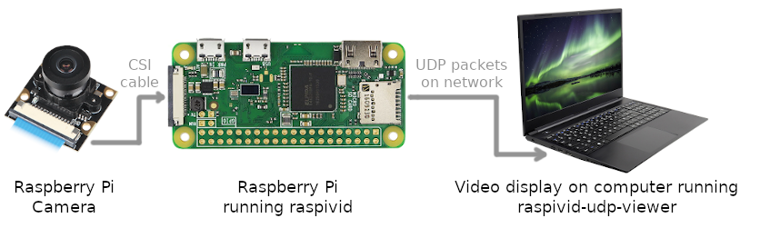

# raspivid-udp-viewer



This viewer (a UDP server listening by default on port 1234) was made because all other means for streaming video of a remote raspberry pi camera are very laggy and complicated. Transmitting a video stream by UDP packets is supported natively by raspivid, and if the video stream is encoded as MJPEG, it's easy to process, and quite realtime.

Once this program is running, try executing this on your raspberry:

```raspivid --nopreview --flush --bitrate 5000000 --framerate 40 --exposure auto -t 0 --codec MJPEG -w 640 -h 480 -v -o udp://YOUR_PC_IP:1234```

